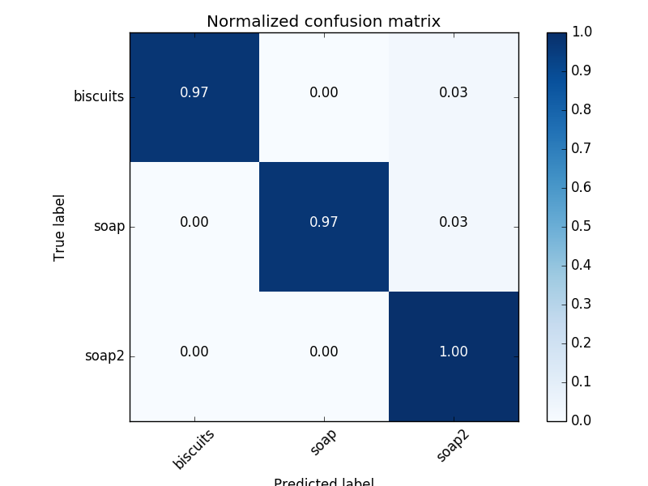
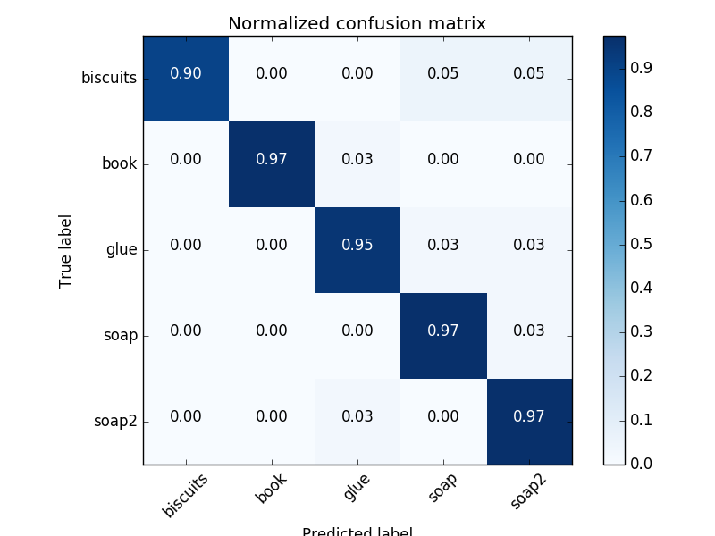
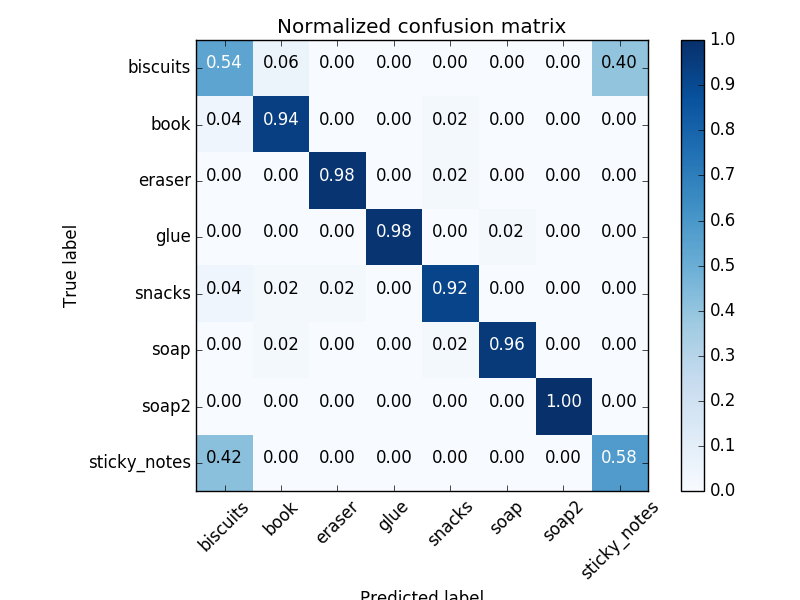
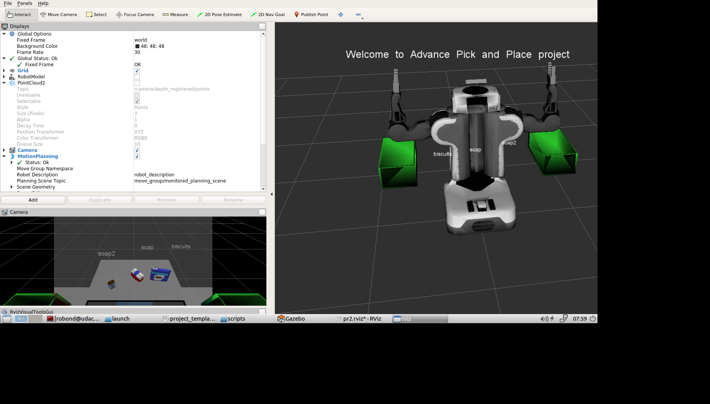
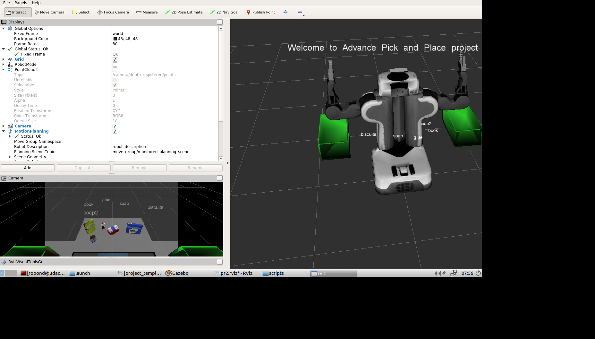
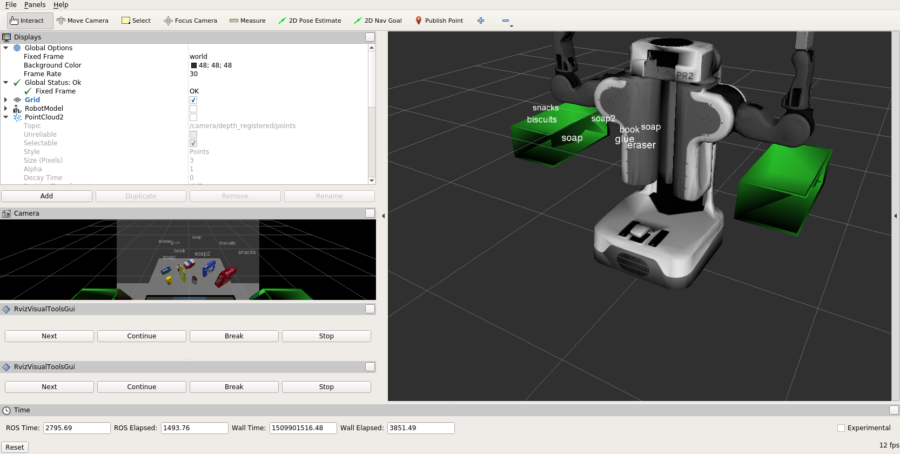

# Robo_nd Project3 3D Perception

---
## Project: Kinematics Pick & Place

---

**Steps to complete the project:**  

1. Set up your ROS Workspace.
2. Download or clone the [project repository](https://github.com/udacity/RoboND-Perception-Project) into the ***src*** directory of your ROS Workspace.  
3.Set up the downsampling and RANSAC pipeline.
4.Set up the cluster pipeline.
5.Set up svm pipeline for recognition.
6. Fill in the `Project_code.py` with my own written code. 

---

## Pipeline setup
### 1. Run the pipeline for sampling
1. As point cloud stored in [voxel_downsampled.pcd], firstly through the  domnsampling to reduce the number of point clouds.
2. Then pass through the filter along the 'y' and 'z' axis to get rid of useless point clouds,and get [pass_through_filtered.pcd]
3. RANSAC to fit the cloud points into the model, with registered indices to separate the objects in [extracted_outliers.pcd] from the table [extracted_inliers.pcd]
### 1. Run the segmentation and cluster pipeline
The clustered point clouds are stored in [table_scene_lms400_outliers.pcd]
### 1. Run the recognition pipeline
Use "compute_color_histograms()" and "compute_normal_histograms()" function from the capture_features module and then the feasture vector is obtained and can be used as the training set for svm, for the 3 world's scenes with 3 different pickup lists, then the svm should load accordingly the right dataset, then the normalized confusion matrix is presented as in

 &emsp; &emsp;  &emsp;  &emsp; &emsp; &emsp;  &emsp;  &emsp; &emsp; &emsp;  &emsp;  &emsp;&emsp; &emsp;  &emsp;  &emsp;Confusion_matrxi_scene1

## Implementation in project environment		
The pipeline is same as above and an additional step is added for the filtering out the noise points using statistical method . Then the core part of the recognition is done within a nested loop, the outside loop is incremented with the object enumeration in the pickup list, in the inner loop the compare, between the recognized object in cluster cloud and the one in pickup list is run, to check if the recognized object is right there and then calculate the centroid of the target, which will be used for pick and place task.
The outcome is quite good, in scene 1 and scene 2, all objects are recognized correctly, in scene 3 only one object is not recognized sometimes due to the occlusion caused by another object, the camera pose is static in my test and the distance between them is also very small.

And each set of parameters for the recognized object is aslo stored into the dictionary and forwarded to the yaml file,[output_1.yaml] ,[output_2.yaml], [output_3.yaml] 
The request for the pick and place information is commented out because I do want to make the infomation in my termial clean without the red error promption.
I think if the robot coud rotate a little, then the occluded object will be found again, so the command to the joint should be added in the futrue to solve the problem in scene3
And due to business for my graduation, the additional tasks is not considered, maybe later I will explore it.Thanks a lot!

