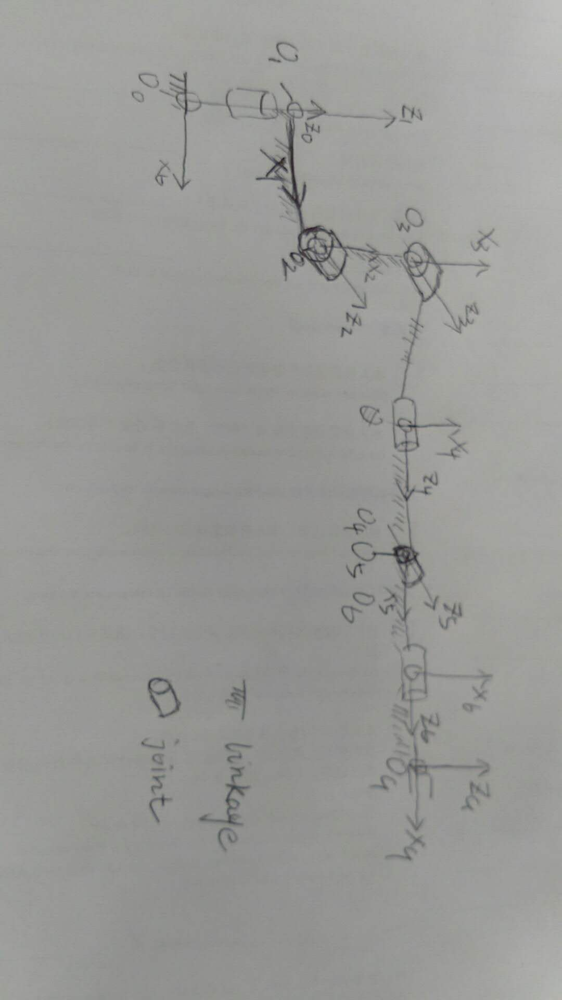
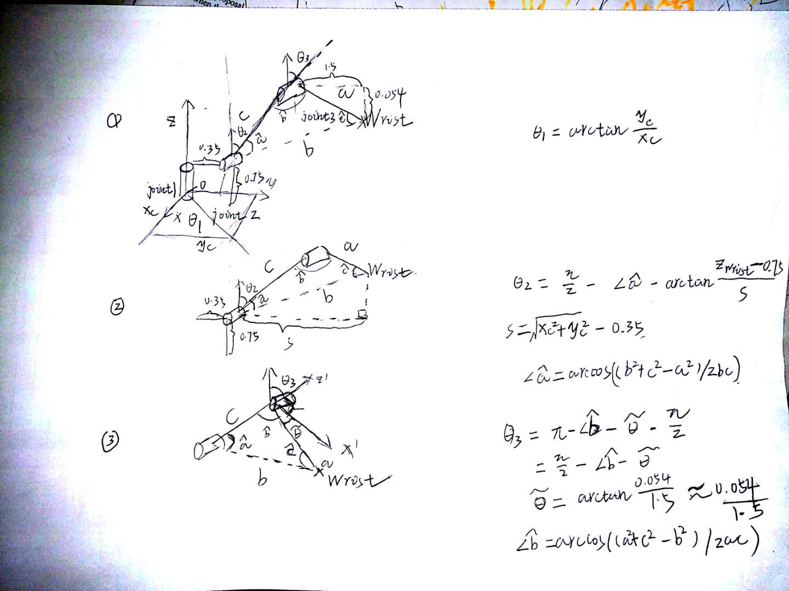

## Project: Kinematics Pick & Place

---

**Steps to complete the project:**  

1. Set up your ROS Workspace.
2. Download or clone the [project repository](https://github.com/udacity/RoboND-Kinematics-Project) into the ***src*** directory of your ROS Workspace.  
3. Experiment with the forward_kinematics environment and get familiar with the robot.
4. Launch in [demo mode](https://classroom.udacity.com/nanodegrees/nd209/parts/7b2fd2d7-e181-401e-977a-6158c77bf816/modules/8855de3f-2897-46c3-a805-628b5ecf045b/lessons/91d017b1-4493-4522-ad52-04a74a01094c/concepts/ae64bb91-e8c4-44c9-adbe-798e8f688193).
5. Perform Kinematic Analysis for the robot following the [project rubric](https://review.udacity.com/#!/rubrics/972/view).
6. Fill in the `IK_server.py` with your Inverse Kinematics code. 

## [Rubric](https://review.udacity.com/#!/rubrics/972/view) Points
### Here I will consider the rubric points individually and describe how I addressed each point in my implementation.  

---
### Writeup / README

#### 1. Provide a Writeup / README that includes all the rubric points and how you addressed each one.  You can submit your writeup as markdown or pdf.  

You're reading it!

### Kinematic Analysis
#### 1. Run the forward_kinematics demo and evaluate the kr210.urdf.xacro file to perform kinematic analysis of Kuka KR210 robot and derive its DH parameters.

Here is the image depicting the coordinate frame assignment for each link and joint.

#### 2. Using the DH parameter table you derived earlier, create individual transformation matrices about each joint. In addition, also generate a generalized homogeneous transform between base_link and gripper_link using only end-effector(gripper) pose.

Links | alpha(i-1) | a(i-1) | d(i) | theta(i)
--- | --- | --- | --- | ---
0->1 | 0 | 0| 0.75 | q1,
1->2 | -pi/2 | 0.35 | 0 | -pi/2 + q2
2->3 | 0 | 1.25 | 0 | q3
3->4 | -pi/2 | -0.054 | 1.5 | q4
4->5 | -pi/2 | 0 | 0 | q5
5->6 | -pi/2 | 0 | 0 | q6
6->EE | 0 | 0 | 0.303 | 0

Homogeneous Transform: 
                            [     cos(theta(i)),                               -sin((theta(i)),            0,                    a(i-1)] 
                            [     sin(theta(i))*cos(alpha(i-1)), cos(theta(i))*cos(alpha(i-1)), -sin(alpha(i-1)), -sin(alpha(i-1))*d(i)] 
                            [     sin(theta(i))*sin(alpha(i-1)), cos(theta(i))*sin(alpha(i-1)),  cos(alpha(i-1)),  cos(alpha(i-1))*d(i)] 
                            [                 0,                 0,                                 0,                                1] 
0->1: 
        Matrix([[0.770653692203051, 0.637254177462812, 0, 0],  
                [-0.637254177462812, 0.770653692203051, 0, 0],  
                [0, 0, 1.00000000000000, 0.750000000000000],  
                [0, 0, 0, 1.00000000000000]])  
1->2: 
        Matrix([[0.511509516900746, 0.859277611787928, 0, 0.350000000000000],  
                [0, 0, 1.00000000000000, 0],  
                [0.859277611787928, -0.511509516900746, 0, 0],  
                [0, 0, 0, 1.00000000000000]])  
2->3: 
        Matrix([[0.932670486172636, 0.360729488983779, 0, 1.25000000000000],  
                [-0.360729488983779, 0.932670486172636, 0, 0],  
                [0, 0, 1.00000000000000, 0],  
                [0, 0, 0, 1.00000000000000]])  
3->4: 
        Matrix([[-0.175968476154439, -0.984395802205538, 0, -0.0540000000000000],  
                [0, 0, 1.00000000000000, 1.50000000000000],  
                [-0.984395802205538, 0.175968476154439, 0, 0],  
                [0, 0, 0, 1.00000000000000]])  
4->5: 
        Matrix([[0.361439500197349, -0.932395563962576, 0, 0],  
                [0, 0, -1.00000000000000, 0],  
                [0.932395563962576, 0.361439500197349, 0, 0],  
                [0, 0, 0, 1.00000000000000]])  
5->6: 
        Matrix([[0.989173071246926, 0.146753654536857, 0, 0],  
                [0, 0, 1.00000000000000, 0],  
                [0.146753654536857, -0.989173071246926, 0, 0],  
                [0, 0, 0, 1.00000000000000]])  
6->EE: 
        Matrix([[1.00000000000000, 0, 0, 0],  
                [0, 1.00000000000000, 0, 0],  
                [0, 0, 1.00000000000000, 0.303000000000000],  
                [0, 0, 0, 1.00000000000000]])  

base_link->EE:  
        Matrix([[0.470546041432307, 0.0550175684822595, 0.880658554747914, 2.16208696123001],  
                [-0.879290873482014, 0.112616370617353, 0.462779767146546, -1.42695939385252],  
                [-0.0737155526576442, -0.992114217329474, 0.101367633242092, 1.55091609411822],  
                [0, 0, 0, 1.00000000000000]])  

#### 3. Decouple Inverse Kinematics problem into Inverse Position Kinematics and inverse Orientation Kinematics; doing so derive the equations to calculate all individual joint angles.

The first three joints are calculated via trigonometry as the image2 shows, the three individual parts in picture denote the angle derivation, the base coordinate is fixed as in the first part within picture 1, theta1 about joint1 is directly projected onto the x-y plane. Then the second part denotes the derivation for theta2 about joint2, the last part in the picture with the derivation for the theta3 about joint3, the small zag is due to the initial offset according to DH psarameter table.

For theta4, theta5, theta6 the solution is based on the inference from the 3D rotaion matrix, the rotation order follows the extrinsic transform x-y-z (1:roll-2:pitch-3:yaw), derivation below, s denoting sin, and c denoting cos.
        Matrix([[r11, r12, r13],  
                [r21, r22, r23],  
                [r31, r32, r33]]) 
       equivalent to:
        Matrix([[-s1s3+c1c2c3, s3c1+s1c2c3, -s2c3],  
                [c1c2,               -s1c2,    c2],  
                [s1c3+s3c1c2,  c1c3-s1s3c2,  s2s3]]) 
Substitue the component in the matrix into the arctan function the last three angles will be attained.   
            theta4 = atan2(r33, -r13) 
            theta5 = atan2(sqrt(r33 * 33 + r13 * r13), r23) 
            theta6 = atan2(-r22, r21) 
		

### Project Implementation

#### 1. Fill in the `IK_server.py` file with properly commented python code for calculating Inverse Kinematics based on previously performed Kinematic Analysis. Your code must guide the robot to successfully complete 8/10 pick and place cycles. Briefly discuss the code you implemented and your results. 

At first, when the position is available from the request, from line 29 to line 72, firstly define the modified DH parameter, then define modified DH transform matrix, then create individual transform matrix for each joint, lastly extract rotation matrix from the transform matrix. All the invariant definations are defined outside the loop, 
In the loop from line 76 to line 128, the inverse solution for the decoupled rotation and postion is calculated, the main strategy here is to substitute the corresponding value into the symbols, so the values are fed into the matrix directly to speed up the calculation.
[Errors between FK and IK is analysed](Debug_error_eva.png)

As the snapshot from image3 shows, the theta error for the individual joint is in acceptable range and the error increases with the accumulative error from theta1 to end effector, 
The image4 shows the final result from top view, 8 success with only one failure in the whole 9 tests, the cylinder coulde be accurately place into the bin with approximately 90% successful rate, however, sometimes the cylinder is dropped onto the ground, this may be due to the angle solution, still not the best one, the further optimization should be focused on the finding the best solution, not reaching the limits for individual joint. E.g, the gripper (joint5 and joint6)should be rotated downwards to make sure the drop-off smoothly. 
[The final outcome](Final_outcome.jpg)

